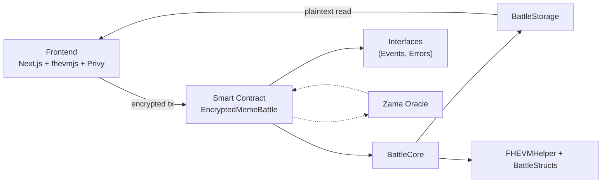
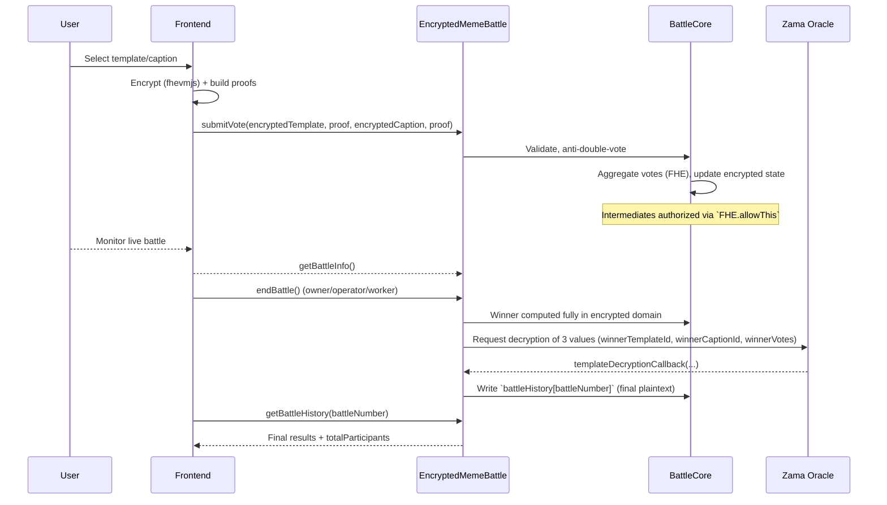
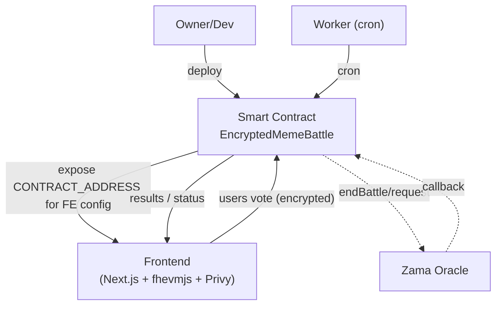
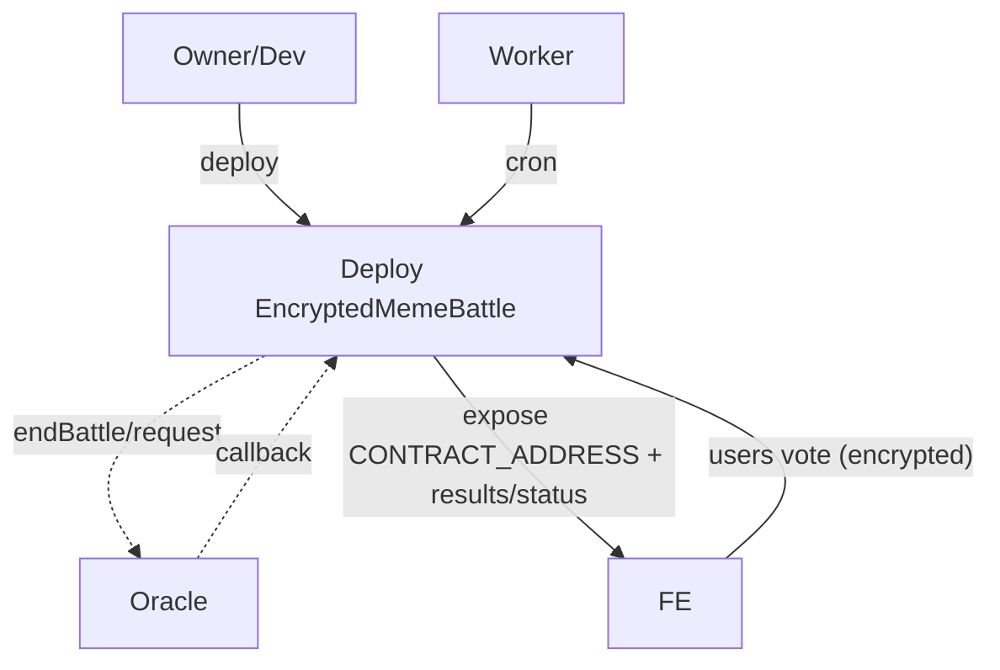

# EncryptedMemeBattle v3 — System Architecture

A privacy-preserving meme battle built on Zama FHEVM. Users submit encrypted votes; the contract processes votes entirely in the encrypted domain (homomorphic), and only three final values are decrypted via a single oracle callback. Final results are written on-chain into history for simple and reliable frontend reads.

---

## Main Components

- `contracts/EncryptedMemeBattle.sol` — Public interface and oracle callback handler
- `contracts/core/BattleCore.sol` — Battle lifecycle, encrypted vote processing, FHE-native winner computation, history writes
- `contracts/storage/BattleStorage.sol` — All state, including `battleHistory` and `battleParticipants`
- `contracts/libraries/FHEVMHelper.sol` — FHE utilities and minimal 3-value oracle payload decoder
- `contracts/libraries/BattleStructs.sol` — Return/view structs
- `contracts/interfaces/*` — Events, custom errors, decryption callback interface

---

## Component Diagram

- Frontend sends tx with encrypted data and proofs.
- `EncryptedMemeBattle` is the entrypoint; it delegates to `BattleCore`.
- `BattleCore` performs homomorphic computation and accesses `BattleStorage`.
- `FHEVMHelper` provides FHE primitives/utilities; `BattleStructs` standardizes data shapes.
- Oracle callback returns exactly three values (template, caption, votes).

---

## Data Flow

---

## Public Solidity API

- `submitVote(bytes32 encryptedTemplateId, bytes encryptedTemplateProof, bytes32 encryptedCaptionId, bytes encryptedCaptionProof)`
- `getBattleInfo() → BattleStructs.BattleInfo`
- `getBattleHistory(uint256 battleNumber) → BattleStructs.BattleResults`
- `getBattleWinner() → (uint8 winnerTemplateId, uint16 winnerCaptionId, uint32 winnerVotes)`
- `getBattleParticipants(uint256 battleNumber) → uint256`
- `getBattleParticipantsBatch(uint256[] battleNumbers) → uint256[]`
- `setBattleDuration(uint256 newDuration)` — owner only
- `getContractInfo() → BattleStructs.ContractInfo`

---

## Storage Model

- `battleHistory[battleNumber]` → final results: `{ winnerTemplateId, winnerCaptionId, winnerVotes, totalParticipants, endTimestamp, revealed }`
- `battleParticipants[battleNumber]` → participants at battle end
- Current battle state, anti-double-voting tracking, configuration

---

## FHE Notes

- Homomorphic primitives: `gt`, `select`, `eq`, `and`
- Intermediate encrypted values require ACL via `FHE.allowThis`
- Oracle payload: exactly 3 values; decoded by `FHEVMHelper.decodeWinnerInfo`

---

## Privacy & Gas

- Only final winner data is decrypted (no per-template statistics)
- Single callback reduces gas and attack surface
- Immutable history prevents costly recomputation

---

## Networks

- Zama Devnet: full FHEVM + oracle
- Sepolia: FHEVM-compatible, oracle availability may vary
- Local Hardhat: voting works, no oracle decryption

---

## Deployment/Worker (Summary)

- Deploy contract → configure frontend contract address.
- Worker (cron) can call `endBattle()` automatically.
- Oracle callback finalizes results; frontend reads `battleHistory` for display.
# EncryptedMemeBattle v3 — System Architecture

A privacy-preserving meme battle built on Zama FHEVM. Users submit encrypted votes; the contract processes votes entirely in the encrypted domain (homomorphic), and only three final values are decrypted via a single oracle callback. Final results are written on-chain into history for simple and reliable frontend reads.

---

## Main Components

- `contracts/EncryptedMemeBattle.sol` — Public interface and oracle callback handler
- `contracts/core/BattleCore.sol` — Battle lifecycle, encrypted vote processing, FHE-native winner computation, history writes
- `contracts/storage/BattleStorage.sol` — All state, including `battleHistory` and `battleParticipants`
- `contracts/libraries/FHEVMHelper.sol` — FHE utilities and minimal 3-value oracle payload decoder
- `contracts/libraries/BattleStructs.sol` — Return/view structs
- `contracts/interfaces/*` — Events, custom errors, decryption callback interface

---

## Component Diagram

- Frontend sends tx with encrypted data and proofs.
- `EncryptedMemeBattle` is the entrypoint; it delegates to `BattleCore`.
- `BattleCore` performs homomorphic computation and accesses `BattleStorage`.
- `FHEVMHelper` provides FHE primitives/utilities; `BattleStructs` standardizes data shapes.
- Oracle callback returns exactly three values (template, caption, votes).

---

## Data Flow

---

## Public Solidity API

- `submitVote(bytes32 encryptedTemplateId, bytes encryptedTemplateProof, bytes32 encryptedCaptionId, bytes encryptedCaptionProof)`
- `getBattleInfo() → BattleStructs.BattleInfo`
- `getBattleHistory(uint256 battleNumber) → BattleStructs.BattleResults`
- `getBattleWinner() → (uint8 winnerTemplateId, uint16 winnerCaptionId, uint32 winnerVotes)`
- `getBattleParticipants(uint256 battleNumber) → uint256`
- `getBattleParticipantsBatch(uint256[] battleNumbers) → uint256[]`
- `setBattleDuration(uint256 newDuration)` — owner only
- `getContractInfo() → BattleStructs.ContractInfo`

---

## Storage Model

- `battleHistory[battleNumber]` → final results: `{ winnerTemplateId, winnerCaptionId, winnerVotes, totalParticipants, endTimestamp, revealed }`
- `battleParticipants[battleNumber]` → participants at battle end
- Current battle state, anti-double-voting tracking, configuration

---

## FHE Notes

- Homomorphic primitives: `gt`, `select`, `eq`, `and`
- Intermediate encrypted values require ACL via `FHE.allowThis`
- Oracle payload: exactly 3 values; decoded by `FHEVMHelper.decodeWinnerInfo`

---

## Privacy & Gas

- Only final winner data is decrypted (no per-template statistics)
- Single callback reduces gas and attack surface
- Immutable history prevents costly recomputation

---

## Networks

- Zama Devnet: full FHEVM + oracle
- Sepolia: FHEVM-compatible, oracle availability may vary
- Local Hardhat: voting works, no oracle decryption

---

## Deployment/Worker (Summary)

- Deploy contract → configure frontend contract address.
- Worker (cron) can call `endBattle()` automatically.
- Oracle callback finalizes results; frontend reads `battleHistory` for display.
