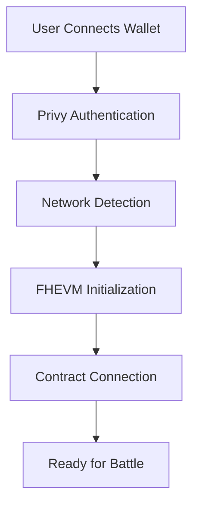
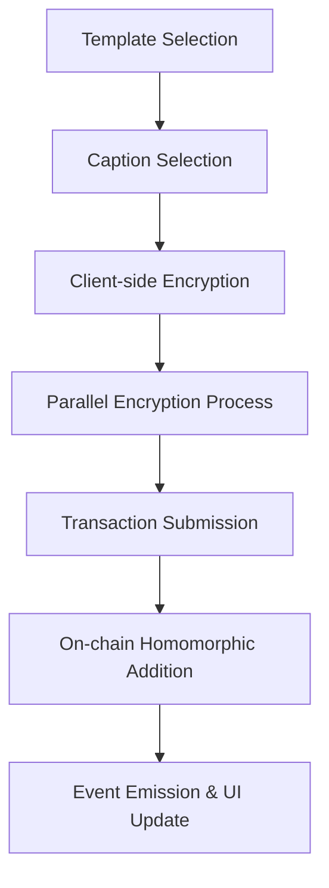
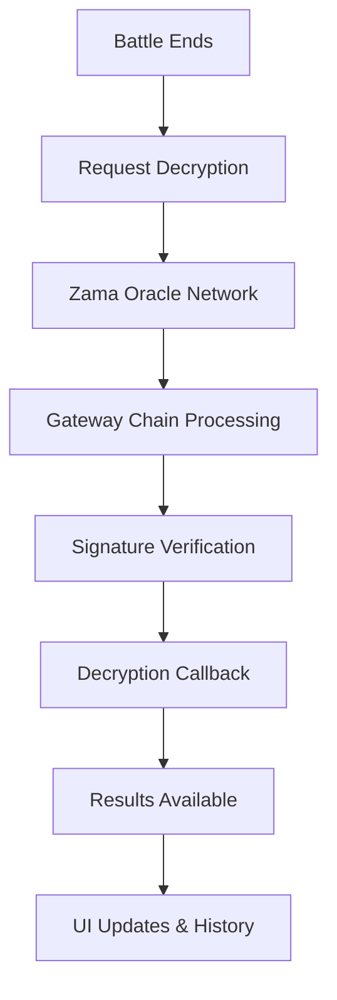

# Meme Battle Royale - Architecture Documentation

**Created by 0xSyncroot**

A next-generation privacy-preserving meme battle platform powered by Zama's FHEVM technology with enterprise-grade modular architecture.

## 🏗️ Project Structure

```
meme-battle-royale/
├── 📁 blockchain/                    # FHEVM Smart Contracts (v3.0.0)
│   ├── 📁 contracts/
│   │   ├── EncryptedMemeBattle.sol             # 🎯 Main contract (481 lines)
│   │   ├── 📁 core/
│   │   │   └── BattleCore.sol                  # ⚙️ Battle mechanics & logic (305 lines)
│   │   ├── 📁 storage/
│   │   │   └── BattleStorage.sol               # 💾 Organized state management (150+ lines)
│   │   ├── 📁 libraries/
│   │   │   ├── BattleStructs.sol               # 📊 Data structures (146 lines)
│   │   │   └── FHEVMHelper.sol                 # 🔧 FHEVM utilities (199 lines)
│   │   └── 📁 interfaces/
│   │       ├── IBattleEvents.sol               # 📢 Event definitions (50+ lines)
│   │       ├── IBattleErrors.sol               # ❌ Custom errors (30+ lines)
│   │       └── IDecryptionCallbacks.sol        # 🔐 FHEVM callback interfaces (34 lines)
│   ├── 📁 scripts/
│   │   ├── deployEncryptedMemeBattle.js        # 🚀 Production deployment
│   │   ├── checkBattleState.js                 # 📊 State monitoring
│   │   └── battleWorker.js                     # 🤖 Battle automation
│   ├── 📁 test/
│   │   └── EncryptedMemeBattle.test.js         # Comprehensive test suite
│   ├── hardhat.config.js                      # Network configurations
│   ├── package.json                           # Dependencies (FHEVM, Oracle)
│   └── env.example                             # Environment template
│
├── 📁 frontend/                      # Next.js 15 DApp Interface
│   ├── 📁 src/
│   │   ├── 📁 app/                            # Next.js 15 App Router
│   │   │   ├── layout.tsx                     # Root layout with metadata
│   │   │   ├── page.tsx                       # Main application
│   │   │   ├── providers.tsx                  # Privy & React Query providers
│   │   │   └── globals.css                    # TailwindCSS globals
│   │   ├── 📁 components/
│   │   │   ├── 📁 features/                   # Battle-specific components
│   │   │   │   ├── MemeTemplateGrid.tsx       # Template selection (12 memes)
│   │   │   │   ├── SubmissionForm.tsx         # Encrypted vote submission
│   │   │   │   ├── LiveBattle.tsx             # Real-time battle progress
│   │   │   │   ├── Results.tsx                # Oracle decryption results
│   │   │   │   ├── BattleHistory.tsx          # Historical battle viewer
│   │   │   │   └── WalletConnect.tsx          # Privy wallet integration
│   │   │   ├── 📁 layout/                     # Navigation & structure
│   │   │   │   ├── Header.tsx                 # Main header
│   │   │   │   ├── Footer.tsx                 # FHEVM-branded footer
│   │   │   │   ├── NavigationTabs.tsx         # Tab system
│   │   │   │   ├── ContestStatus.tsx          # Battle timing
│   │   │   │   ├── LobbyContent.tsx           # Main lobby
│   │   │   │   └── LandingPage.tsx            # Landing view
│   │   │   └── 📁 ui/                         # Reusable components
│   │   │       ├── Button.tsx                 # Button variants
│   │   │       ├── Card.tsx                   # Card containers
│   │   │       ├── Input.tsx                  # Form inputs
│   │   │       ├── Select.tsx                 # Select dropdowns
│   │   │       ├── Shimmer.tsx                # Loading animations
│   │   │       └── ConnectionErrorMask.tsx    # Error overlay
│   │   ├── 📁 hooks/                          # Custom React hooks
│   │   │   ├── useContract.ts                 # Smart contract integration
│   │   │   ├── useFHEVM.ts                   # FHEVM encryption management
│   │   │   └── useConnectionError.ts          # Error handling
│   │   ├── 📁 lib/                            # Core libraries
│   │   │   ├── 📁 fhevm/                     # FHEVM SDK integration
│   │   │   │   ├── index.ts                  # Main FHEVM interface
│   │   │   │   ├── encryption.ts             # Encryption utilities
│   │   │   │   └── sdk-loader.ts             # SDK initialization
│   │   │   ├── 📁 contract/                  # Contract utilities
│   │   │   └── utils.ts                      # Helper functions
│   │   ├── 📁 types/                         # TypeScript definitions
│   │   │   └── index.ts                      # Shared types
│   │   ├── 📁 constants/                     # Configuration constants
│   │   │   └── index.ts                      # Network configs, addresses
│   │   └── 📁 utils/                         # Utility functions
│   │       └── cn.ts                         # Tailwind class merging
│   ├── 📁 public/                            # Static assets
│   │   ├── logo.png                          # Brand logo
│   │   ├── favicon.ico                       # Favicon
│   │   └── memes/                            # Meme template images
│   ├── package.json                          # Next.js 15, React 19, TypeScript
│   └── env.local.example                     # Environment template
│
├── 📁 worker/                        # Battle Automation Worker
│   ├── index.js                              # Node-cron automated worker
│   ├── package.json                          # Dependencies (ethers, cron)
│   ├── env.example                           # Configuration template
│   └── README.md                             # Worker documentation
│
├── 📄 README.md                      # Main project documentation
├── 📄 ARCHITECTURE.md                # This file
├── 📄 DEPLOYMENT_GUIDE.md            # Deployment instructions
├── 🔧 setup.sh                      # Automated setup script
└── 📦 package.json                  # Root project configuration
```

**Total: 1,515+ lines of smart contract code across 8 modular files**

## 🏛️ Smart Contract Architecture (v3.0.0)

### Enterprise Modular Design by 0xSyncroot

The smart contract system uses a **separation of concerns** approach with 8 specialized components:

| Component | Lines | Purpose | Key Features |
|-----------|-------|---------|-------------|
| **EncryptedMemeBattle.sol** | 481 | Main contract & callbacks | FHEVM oracle integration, public API |
| **BattleCore.sol** | 305 | Business logic | Battle lifecycle, voting mechanics |
| **BattleStorage.sol** | 150+ | State management | Organized storage, gas optimization |
| **FHEVMHelper.sol** | 199 | FHEVM operations | Reusable encryption utilities |
| **BattleStructs.sol** | 146 | Data modeling | Type-safe structures |
| **IBattleEvents.sol** | 50+ | Event definitions | Centralized event management |
| **IBattleErrors.sol** | 30+ | Error handling | Gas-efficient custom errors |
| **IDecryptionCallbacks.sol** | 34 | Callback interfaces | FHEVM oracle callback definitions |

### 1. EncryptedMemeBattle.sol (Main Contract)

**🎯 Primary Responsibilities:**
- Contract initialization with battle configuration
- FHEVM oracle callback handling (`templateDecryptionCallback`, `captionDecryptionCallback`)
- Public interface for frontend integration
- Administrative functions (owner/operator management)

**Key Functions:**
```solidity
// Battle management
function startBattle() external onlyBattleOperator;
function endBattle() external onlyBattleOperator;
function requestTemplateResultsDecryption() external;

// Vote submission
function submitVote(bytes calldata encryptedTemplate, bytes calldata templateProof,
                   bytes calldata encryptedCaption, bytes calldata captionProof) external;

// Oracle callbacks
function templateDecryptionCallback(uint256 requestId, uint32[] calldata results);
function captionDecryptionCallback(uint256 requestId, uint8 captionId);
```

### 2. BattleCore.sol (Core Business Logic)

**⚙️ Core Features:**
- Battle lifecycle management (start/end battles)
- Encrypted voting mechanics using FHEVM
- Privacy-preserving vote processing and aggregation
- Battle history management and result tracking

**Security Features:**
- Access control modifiers (`onlyOwner`, `onlyBattleOperator`)
- Vote validation and anti-double-voting protection
- Secure random caption selection from encrypted votes
- Battle state transition management

### 3. BattleStorage.sol (Storage Layer)

**💾 Storage Categories:**
- **Configuration**: `MAX_TEMPLATES`, `MAX_CAPTIONS`, `BATTLE_DURATION`
- **Battle State**: Current battle info, timing, participation
- **Encrypted Data**: Vote mappings, caption storage
- **Results**: Decrypted results, battle history

### 4. IDecryptionCallbacks.sol (Interface Design)

**🔐 Professional Interface Architecture:**
- Separates FHEVM oracle callback definitions from implementation
- Provides type-safe callback function signatures
- Enables clean contract inheritance and implementation

**Interface Functions:**
```solidity
interface IDecryptionCallbacks {
    function templateDecryptionCallback(
        uint256 requestId,
        bytes memory cleartexts,
        bytes memory decryptionProof
    ) external;

    function captionDecryptionCallback(
        uint256 requestId,
        bytes memory cleartexts,
        bytes memory decryptionProof
    ) external;
}
```

**Architecture Benefits:**
- **Interface Segregation**: Clear separation of callback concerns
- **Implementation Flexibility**: Contracts can implement as needed
- **Type Safety**: Compiler-enforced function signatures
- **Maintainability**: Changes to interface don't affect unrelated code

### 5. FHEVM Integration Details

**Encryption Types Used:**
```solidity
// Template voting (5 templates max)
mapping(uint8 => euint8) private templateVotes;

// Caption selection (100 captions max)  
mapping(address => euint8) private userCaptionVotes;

// Vote aggregation
euint32 private totalVotes;
```

**Oracle Integration:**
- **Gateway Chain**: Uses Zama's oracle network for decryption
- **Callback System**: Asynchronous result processing
- **Request Tracking**: Prevents replay attacks with unique request IDs

## 🎨 Frontend Architecture (Next.js 15)

### Modern React Architecture

**Tech Stack:**
- **Next.js 15** with App Router
- **React 19** with concurrent features
- **TypeScript 5** with strict mode
- **TailwindCSS** for styling
- **Privy** for wallet authentication
- **React Hot Toast** for notifications

### Component Hierarchy

#### 🚀 App Router (`src/app/`)
```typescript
layout.tsx          // Root layout with providers, metadata, favicon
├── providers.tsx   // Privy auth, React Query, toast setup
├── page.tsx        // Main application shell
└── globals.css     // TailwindCSS imports and custom styles
```

#### 🎯 Feature Components (`src/components/features/`)

**MemeTemplateGrid.tsx** - Template Selection
- 12 meme templates in interactive grid
- Responsive design (mobile/tablet/desktop)
- Selection state management

**SubmissionForm.tsx** - Encrypted Vote Submission
- Parallel encryption optimization (`Promise.all`)
- Progress indicators with visual feedback
- Custom success toast with transaction links
- Timeout protection (30s transaction, 60s confirmation)

**LiveBattle.tsx** - Real-time Battle Progress
- Privacy-preserving progress visualization
- Encrypted vote count display
- Real-time updates via polling

**Results.tsx** - Oracle Decryption Results
- Shimmer loading states to prevent UI jank
- Winner announcement with vote counts
- Battle history integration

**BattleHistory.tsx** - Historical Battle Viewer
- Pagination for completed battles
- Winner statistics and participation data
- Empty state handling

### 🎣 Custom Hooks Architecture

#### useContract.ts - Smart Contract Integration
```typescript
interface ContractState {
  readOnlyContract: ethers.Contract | null;  // Public RPC for reads
  contractWithSigner: ethers.Contract | null; // Wallet for writes
  isConnected: boolean;
  isLoading: boolean;
  error: string | null;
}

// Dual-provider architecture for optimal performance
const useContract = () => ({
  // Connection state
  isConnected, isLoading, error,
  
  // Core operations
  getBattleInfo, submitVote, hasUserVoted,
  
  // Results & decryption
  getTemplateResults, getWinners, requestTemplateResultsDecryption,
  
  // Battle history
  getBattleHistory, getCompletedBattleCount, getLatestCompletedBattle
});
```

#### useFHEVM.ts - FHEVM Encryption Management
```typescript
const useFHEVM = () => ({
  // State management
  initialized: boolean,
  error: FHEVMError | null,
  
  // Encryption functions
  encryptVote: (templateId: number, contractAddress: string) => Promise<EncryptedData>,
  encryptCaptionText: (captionId: number, contractAddress: string) => Promise<EncryptedData>,
  
  // Utilities
  getUserAddress: () => Promise<string>,
  clearError: () => void
});
```

### 🔐 FHEVM Integration Flow

#### Client-Side Encryption Process
```typescript
// 1. Initialize FHEVM with network detection
const fhevmInstance = await getFHEVMInstance();

// 2. Create encrypted input with ACL permissions
const input = createEncryptedInput(fhevmInstance, {
  contractAddress: CONTRACT_ADDRESS,
  userAddress: await getUserAddress()
});

// 3. Add data and generate proof
input.add8(templateId);
const { encryptedData, proof } = await input.encrypt();

// 4. Submit with parallel encryption for performance
const [encryptedTemplate, encryptedCaption] = await Promise.all([
  encryptVote(selectedTemplate, CONTRACT_ADDRESS),
  encryptCaptionText(selectedCaption.id, CONTRACT_ADDRESS)
]);
```

## 🔄 Data Flow Architecture

### 1. User Authentication & Initialization


### 2. Battle Participation Flow


### 3. Oracle Decryption Flow


## 🌐 Network Architecture

### Supported Networks

| Network | Chain ID | FHEVM Support | RPC URL | Purpose |
|---------|----------|---------------|---------|---------|
| **Sepolia** | 11155111 | ✅ **Full** | `https://sepolia.infura.io/v3/PROJECT_ID` | **Production** |
| **Zama Devnet** | 8009 | ✅ **Native** | `https://devnet.zama.ai` | **Testing** |
| **Localhost** | 31337 | ⚠️ **Mock** | `http://127.0.0.1:8545` | **Development** |

### FHEVM Infrastructure

#### Zama Components
- **Gateway Chain**: Oracle network for decryption (Chain ID: 55815)
- **Relayer SDK**: Client-side encryption (`fhevmjs` package)
- **Oracle Network**: Asynchronous decryption with signature verification

#### Configuration Management
```typescript
// Network-specific FHEVM configuration
const NETWORK_CONFIGS = {
  sepolia: {
    chainId: 11155111,
    rpcUrl: process.env.NEXT_PUBLIC_SEPOLIA_RPC_URL,
    fhevmSupport: true
  },
  zamaDevnet: {
    chainId: 8009, 
    rpcUrl: process.env.NEXT_PUBLIC_ZAMA_DEVNET_RPC_URL,
    fhevmSupport: true
  }
};
```

## 🛡️ Security Architecture

### Privacy Guarantees

1. **Client-Side Encryption**
   - All sensitive data encrypted before leaving user's device
   - Private keys never transmitted or stored
   - Zero-knowledge proofs ensure integrity without revealing data

2. **On-Chain Privacy**
   - Homomorphic operations on encrypted data
   - No intermediate decryption during vote counting
   - Encrypted state storage throughout battle lifecycle

3. **Controlled Decryption**
   - Admin-only result decryption via oracle network
   - User-controlled caption reveals (optional)
   - Cryptographically signed oracle responses

### Attack Resistance

- **MEV Protection**: Encrypted inputs prevent front-running
- **Vote Manipulation**: Individual votes hidden during battle
- **Result Tampering**: Oracle signatures ensure authenticity
- **Privacy Leaks**: Homomorphic operations prevent metadata exposure

## 🚀 Performance Optimizations

### Smart Contract Optimizations
- **Gas Efficiency**: Lazy initialization patterns
- **Storage Optimization**: Packed structs, efficient mappings
- **Batch Operations**: Minimal transaction count
- **Event Optimization**: Indexed parameters for filtering

### Frontend Performance
- **Parallel Encryption**: Concurrent `Promise.all` execution
- **Async Scheduling**: `requestIdleCallback` prevents UI blocking
- **Progressive Loading**: Shimmer states prevent layout shifts
- **Code Splitting**: Route-based dynamic imports
- **Asset Optimization**: Next.js automatic optimizations

### Network Efficiency
- **Dual Provider Strategy**: Public RPC for reads, wallet for writes
- **Connection Pooling**: Efficient RPC usage
- **Event Polling**: Optimized contract state monitoring
- **Caching Strategy**: Aggressive static asset caching

## 🔧 Configuration Management

### Environment Variables

#### Blockchain Configuration (`blockchain/.env`)
```bash
# Ethereum Sepolia (Primary network)
SEPOLIA_RPC_URL=https://sepolia.infura.io/v3/YOUR_PROJECT_ID
SEPOLIA_CHAIN_ID=11155111

# Zama Devnet (Alternative)
ZAMA_DEVNET_RPC_URL=https://devnet.zama.ai
ZAMA_DEVNET_CHAIN_ID=8009

# Deployment & Verification
PRIVATE_KEY=your_private_key_without_0x_prefix
BATTLE_OPERATOR=0x_operator_address_for_automation
ETHERSCAN_API_KEY=your_etherscan_api_key_for_verification
```

#### Frontend Configuration (`frontend/.env.local`)
```bash
# Privy Authentication
NEXT_PUBLIC_PRIVY_APP_ID=your_privy_app_id

# Contract Integration  
NEXT_PUBLIC_CONTRACT_ADDRESS=0x25B6524832E9Cf63D968b305205f1f49e4802f56

# Network RPC URLs
NEXT_PUBLIC_SEPOLIA_RPC_URL=https://sepolia.infura.io/v3/YOUR_PROJECT_ID
NEXT_PUBLIC_ZAMA_DEVNET_RPC_URL=https://devnet.zama.ai
```

## 🚀 Deployment & Contract Verification

### Smart Contract Deployment

#### Deploy to Networks
```bash
# Local Hardhat network
npm run deploy

# Zama Devnet (Full FHEVM support)
npm run deploy:zama

# Ethereum Sepolia (FHEVM with testnet)
npm run deploy:sepolia
```

### Contract Verification on Sepolia

#### Automated Verification
```bash
# Set deployed contract address
export CONTRACT_ADDRESS=0xYOUR_DEPLOYED_ADDRESS

# Run verification script
npx hardhat run scripts/verifyContract.js --network sepolia
```

#### Manual Verification
```bash
# Direct Hardhat verification
npx hardhat verify --network sepolia \
  0xCONTRACT_ADDRESS \
  5 \
  100 \
  300 \
  0xBATTLE_OPERATOR_ADDRESS
```

#### Etherscan Web Verification
1. Visit https://sepolia.etherscan.io/
2. Navigate to your contract address
3. Click "Contract" → "Verify and Publish"
4. Use compiler version: **v0.8.24+commit.e11b9ed9**
5. Upload flattened source: `npx hardhat flatten contracts/EncryptedMemeBattle.sol`

### Verification Requirements
- **Etherscan API Key**: Required for automated verification
- **Constructor Parameters**: Must match deployment exactly
- **Compiler Settings**: Optimizer enabled, 200 runs
- **Network**: Contract must be deployed on target network

### Troubleshooting Verification
- **Already Verified**: Contract verification successful
- **Parameter Mismatch**: Check constructor arguments
- **Compiler Version**: Ensure exact version match (0.8.24)
- **Network Issues**: Verify deployment network matches

## 🧪 Testing Strategy

### Smart Contract Testing
- **Unit Tests**: Individual function verification
- **Integration Tests**: Complete battle lifecycle
- **FHEVM Simulation**: Local testing with mocked encryption
- **Gas Analysis**: Optimization opportunity identification

### Frontend Testing
- **Component Tests**: UI component isolation
- **Hook Tests**: Custom hook functionality
- **Integration Tests**: End-to-end user workflows
- **Performance Tests**: Load time and interaction metrics

### Security Audits
- **Encryption Verification**: Client-side encryption correctness
- **Access Control**: Permission system validation
- **Oracle Integration**: Callback security testing

## 📊 Monitoring & Analytics

### Contract Events
```solidity
event BattleStarted(uint256 indexed battleNumber, uint256 endsAt);
event VoteSubmitted(address indexed voter, uint256 indexed battleNumber);
event BattleEnded(uint256 indexed battleNumber, uint8 winnerTemplate);
event ResultsDecrypted(uint256 indexed battleNumber, uint32[] templateVotes);
```

### Performance Metrics
- **Transaction Times**: Submission to confirmation latency
- **Gas Consumption**: Operation cost analysis
- **User Engagement**: Battle participation rates
- **Error Rates**: Failed transaction analysis

## 🔮 Future Enhancements

### Scalability Roadmap
- **Layer 2 Integration**: Polygon zkEVM, Arbitrum support
- **Cross-Chain Battles**: Multi-network competition
- **Batch Voting**: Multiple template support per user

### Feature Expansion
- **Tournament Mode**: Multi-round elimination battles
- **NFT Rewards**: Winner badges and participation tokens
- **Social Integration**: Privacy-preserving leaderboards
- **Custom Templates**: User-uploaded meme support

### Developer Experience
- **SDK Improvements**: Enhanced TypeScript definitions
- **Testing Framework**: Comprehensive FHEVM test utilities
- **Documentation**: Interactive tutorials and examples

## 📋 Interface Definitions

### IDecryptionCallbacks.sol
**🔐 FHEVM Oracle Callback Interfaces:**
- `templateDecryptionCallback()` - Handles template vote decryption results
- `captionDecryptionCallback()` - Processes caption selection decryption

**Architecture Benefits:**
- Professional interface-based design pattern
- Clear contract separation between oracle integration and business logic
- Type-safe callback function signatures
- Enhanced maintainability and testability

### IBattleEvents.sol  
**📢 Event Management:**
- `VoteSubmitted` - User vote confirmation
- `BattleEnded` / `BattleStarted` - Lifecycle events
- `DecryptionRequested` - Oracle interaction tracking
- `TemplateResultsRevealed` / `CombinationResultsRevealed` - Result events

### IBattleErrors.sol
**❌ Error Handling:**
- `BattleNotActive` / `BattleStillActive` - Timing errors
- `InvalidTemplateId` / `InvalidCaptionId` - Validation errors
- `AlreadyVoted` - Anti-double-voting protection
- `NotAuthorized` / `OnlyOwner` - Access control errors

---

## 🏗️ Architecture Summary

**Meme Battle Royale** implements a **privacy-first**, **enterprise-grade** architecture that enables:

✅ **Complete Vote Privacy** during battle progression  
✅ **Homomorphic Vote Counting** without revealing individual choices  
✅ **Oracle-Based Decryption** for fair result revelation  
✅ **MEV-Resistant Design** through encrypted computation  
✅ **Modular Smart Contracts** for maintainability and upgradability  
✅ **Modern Frontend Architecture** with optimal UX and performance  

**Built by 0xSyncroot with Zama's FHEVM - The Future of Confidential Smart Contracts** 🚀