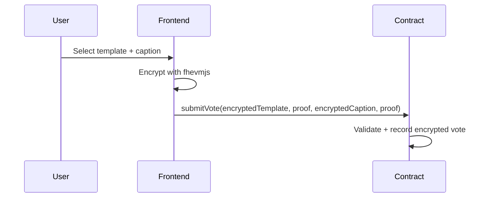
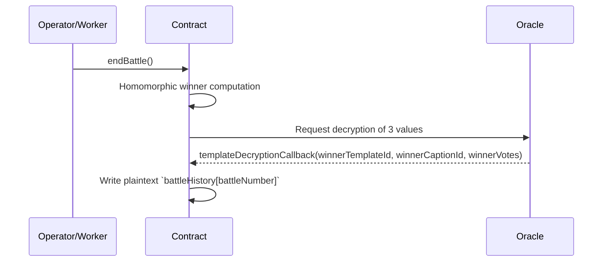

# Meme Battle Royale — Project Documentation

A privacy-preserving meme battle DApp built on Zama's FHEVM (Fully Homomorphic Encryption Virtual Machine). Users submit encrypted votes; the smart contract aggregates and selects the winner homomorphically on-chain, and only three final values are decrypted by an oracle.

- Author: 0xSyncroot  
- Contract (Sepolia): [`0x595609F8B645B7DDF3d382dD382BCC19B9e71748`](https://sepolia.etherscan.io/address/0x595609F8B645B7DDF3d382dD382BCC19B9e71748)
- Stack: FHEVM, Hardhat, Next.js 15, React 19

---

## Goals & Core Values
- 🔐 End-to-end privacy: client-side encryption; only 3 final values ever decrypted
- ⚡ Encrypted computation on-chain: homomorphic counting and comparisons
- 🏆 Transparent reveal: oracle decrypts `winnerTemplateId`, `winnerCaptionId`, `winnerVotes` after the battle ends
- 🔄 Automation-ready: optional worker to orchestrate battle lifecycle

---

## Architecture Overview

```mermaid
flowchart TD
  U[User / Wallet] --> FE[Frontend (Next.js 15 + Privy + fhevmjs)]
  FE -->|encrypt & submit| SC[Smart Contract<br/>EncryptedMemeBattle]
  SC -.-> OR[Zama Oracle]
  OR -.-> SC
  WRK[Worker Automation] --- SC
  SC --> H[On-chain History<br/>(battleHistory, participants)]
```

- Frontend: initializes FHEVM, encrypts `templateId`/`captionId`, submits tx with proofs
- Smart Contract: enforces rules, aggregates encrypted votes, requests oracle decryption of exactly 3 values
- Oracle: returns final winner data via a single callback
- Worker (optional): automates start/end and reveal flow (e.g., via cron)

### Critical Flows

#### 1) Encrypted vote submission


#### 2) End battle and reveal results


---

## Directory Structure

```text
zama-meme-battle/
├── blockchain/                 # FHEVM Smart Contracts (v3.0.0)
│   ├── contracts/
│   │   ├── EncryptedMemeBattle.sol         # Main contract (481 lines)
│   │   ├── core/
│   │   │   └── BattleCore.sol              # Core battle logic (305 lines)
│   │   ├── storage/
│   │   │   └── BattleStorage.sol           # Storage management (150+ lines)
│   │   ├── libraries/
│   │   │   ├── BattleStructs.sol           # Data structures (146 lines)
│   │   │   └── FHEVMHelper.sol             # FHEVM utilities (199 lines)
│   │   └── interfaces/
│   │       ├── IBattleEvents.sol           # Event definitions
│   │       └── IBattleErrors.sol           # Custom errors
│   ├── scripts/
│   │   ├── deployEncryptedMemeBattle.js    # Deployment
│   │   └── checkBattleState.js             # Monitoring
│   ├── test/                               # Contract tests
│   ├── hardhat.config.js                   # Network config
│   └── env.example                         # Env template
├── frontend/                   # Next.js 15 DApp
│   ├── src/
│   │   ├── app/                           # App Router
│   │   ├── components/
│   │   │   ├── features/                  # Battle UI
│   │   │   │   ├── MemeTemplateGrid.tsx
│   │   │   │   ├── SubmissionForm.tsx
│   │   │   │   ├── LiveBattle.tsx
│   │   │   │   ├── Results.tsx
│   │   │   │   ├── BattleHistory.tsx
│   │   │   │   └── WalletConnect.tsx
│   │   │   ├── layout/
│   │   │   └── ui/
│   │   ├── hooks/
│   │   ├── lib/
│   │   ├── constants/
│   │   └── types/
│   ├── package.json
│   └── env.local.example
├── worker/                     # Automation Worker
│   ├── index.js
│   ├── package.json
│   └── env.example
├── setup.sh                    # Automated setup
└── package.json                # Workspace config
```

Approx. 1,481 lines of Solidity split across clear modules.

---

## Quick Setup

### Requirements
- Node.js 18+
- pnpm (recommended) or npm
- Web3 wallet (MetaMask, etc.)

### Option 1: Automated (recommended)
```bash
git clone <repository-url>
cd zama-meme-battle
chmod +x setup.sh
./setup.sh
```
This script checks Node, installs pnpm if needed, installs all workspace deps, compiles contracts, creates env files, and builds the frontend.

### Option 2: Manual
```bash
# Root deps
npm install
# All workspaces
npm run install:all
# Compile contracts
cd blockchain && npm run compile
# Build frontend
cd ../frontend && pnpm run build
```

---

## Environment Configuration

### Blockchain (`blockchain/.env`)
```bash
cd blockchain
cp env.example .env
```
Edit `blockchain/.env`:
```env
SEPOLIA_RPC_URL=https://sepolia.infura.io/v3/YOUR_INFURA_PROJECT_ID
SEPOLIA_CHAIN_ID=11155111
ZAMA_DEVNET_RPC_URL=https://devnet.zama.ai
ZAMA_DEVNET_CHAIN_ID=8009
PRIVATE_KEY=your_private_key_without_0x
```

### Frontend (`frontend/.env.local`)
```bash
cd frontend
cp env.local.example .env.local
```
Edit `frontend/.env.local`:
```env
NEXT_PUBLIC_PRIVY_APP_ID=your_privy_app_id
NEXT_PUBLIC_CONTRACT_ADDRESS=your_deployed_contract_address
NEXT_PUBLIC_SEPOLIA_RPC_URL=https://sepolia.infura.io/v3/YOUR_INFURA_PROJECT_ID
NEXT_PUBLIC_ZAMA_DEVNET_RPC_URL=https://devnet.zama.ai
```

### Worker (optional) (`worker/.env`)
```bash
cd worker
cp env.example .env
```
Edit `worker/.env`:
```env
CONTRACT_ADDRESS=0x_your_deployed_contract_address
RPC_URL=https://sepolia.infura.io/v3/YOUR_PROJECT_ID
CHAIN_ID=11155111
PRIVATE_KEY=worker_private_key_here
CHECK_INTERVAL_MINUTES=1
AUTO_START_BATTLES=true
```

---

## Deploy Smart Contracts

### Sepolia (recommended)
```bash
cd blockchain
npm run check-balance:sepolia
# Optionally set battle operator
BATTLE_OPERATOR=0x_worker_address_here npm run deploy:sepolia
# Or use deployer as operator
npm run deploy:sepolia
```
Example successful deployment (shortened): address `0x595609F8B645B7DDF3d382dD382BCC19B9e71748`.

### Local Hardhat
```bash
# Terminal 1
cd blockchain && npm run node
# Terminal 2
cd blockchain && npm run deploy:localhost
```

After deployment, update `frontend/.env.local`:
```env
NEXT_PUBLIC_CONTRACT_ADDRESS=0x595609F8B645B7DDF3d382dD382BCC19B9e71748
```

---

## Run the DApp
```bash
cd frontend
pnpm run dev
# Open http://localhost:3000
```

---

## Development Commands

### Root
```bash
npm run setup
npm run install:all
npm run build:all
npm run deploy:sepolia
npm run start:frontend
npm run start:worker
npm run test:contracts
npm run clean
```

### Blockchain
```bash
npm run compile
npm run test
npm run deploy:sepolia
npm run deploy:zama
npm run deploy:localhost
npm run node
npm run check-balance
npm run check-state
```

### Frontend
```bash
pnpm run dev
pnpm run build
pnpm run start
pnpm run lint
pnpm run type-check
```

### Worker
```bash
npm run start
npm run dev
```

---

## Troubleshooting (Quick)
- FHEVM init fails: verify Chain ID (11155111/8009), contract address, RPC connectivity; clear browser cache
- Deployment fails: private key must be without 0x prefix; ensure test ETH; check RPC
- Wallet connection fails: correct `NEXT_PUBLIC_PRIVY_APP_ID`, allowed domains, MetaMask on Sepolia
- Build errors: Node 18+, remove `node_modules` and reinstall, verify pnpm version
- Reverted tx: user already voted? battle active? sufficient gas?

---

## Resources
- FHEVM: [Overview](https://docs.zama.ai/fhevm), [fhevmjs](https://docs.zama.ai/fhevm/integrations/js_client), [Solidity](https://docs.zama.ai/fhevm/solidity/getting-started)
- Hardhat: [Docs](https://hardhat.org/docs)
- Next.js 15: [Docs](https://nextjs.org/docs)
- Privy: [Docs](https://docs.privy.io)

---

## License & Credits
- License: MIT (see `LICENSE`)
- Author: 0xSyncroot  
- Contributions: PRs welcome (TypeScript strict, tests, docs)

> Privacy-preserving meme battles powered by Zama FHEVM — fun, safe, transparent, and scalable.